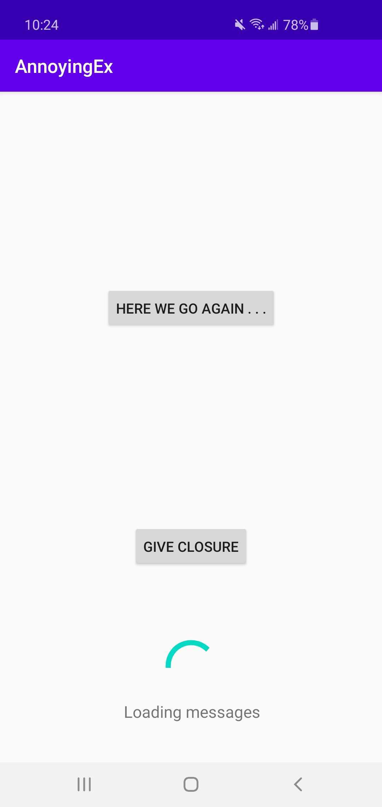
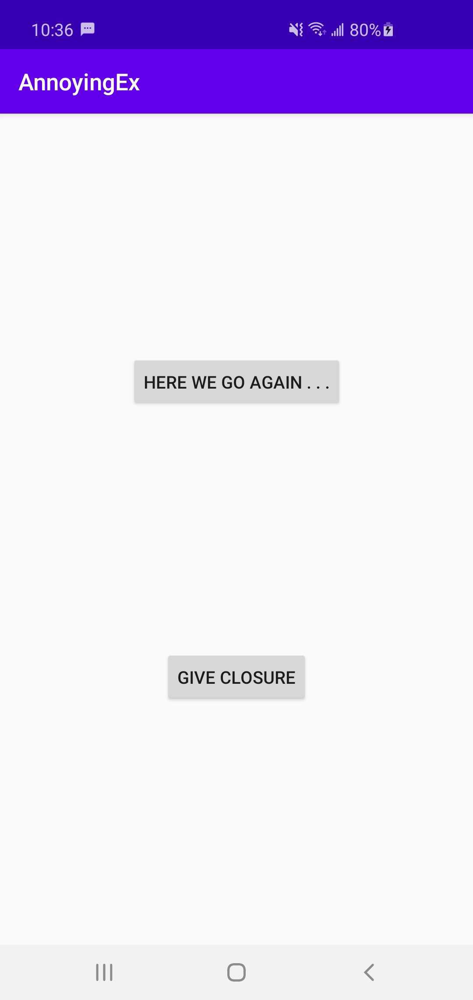
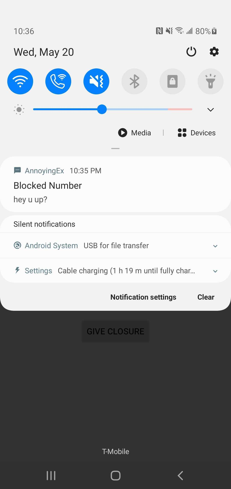

## Homework 5 – Background Tasks and Notifications
## Chris Hogan

The AnnoyingEx App fetches a list of messages one could expect to receive from an annoying ex. When the user presses "Here we go again . . ." they will receive a notification with a random message roughly every 20 minutes, even when the app is not running. The notifications will only be sent while the device is charging. Pressing the "Give closure" button will give closure to the ex and disable the notifications until "Here we go again" is pressed again. Clicking on a notification will show the message contents as a simple text view.

Extra credit attempted: 1

